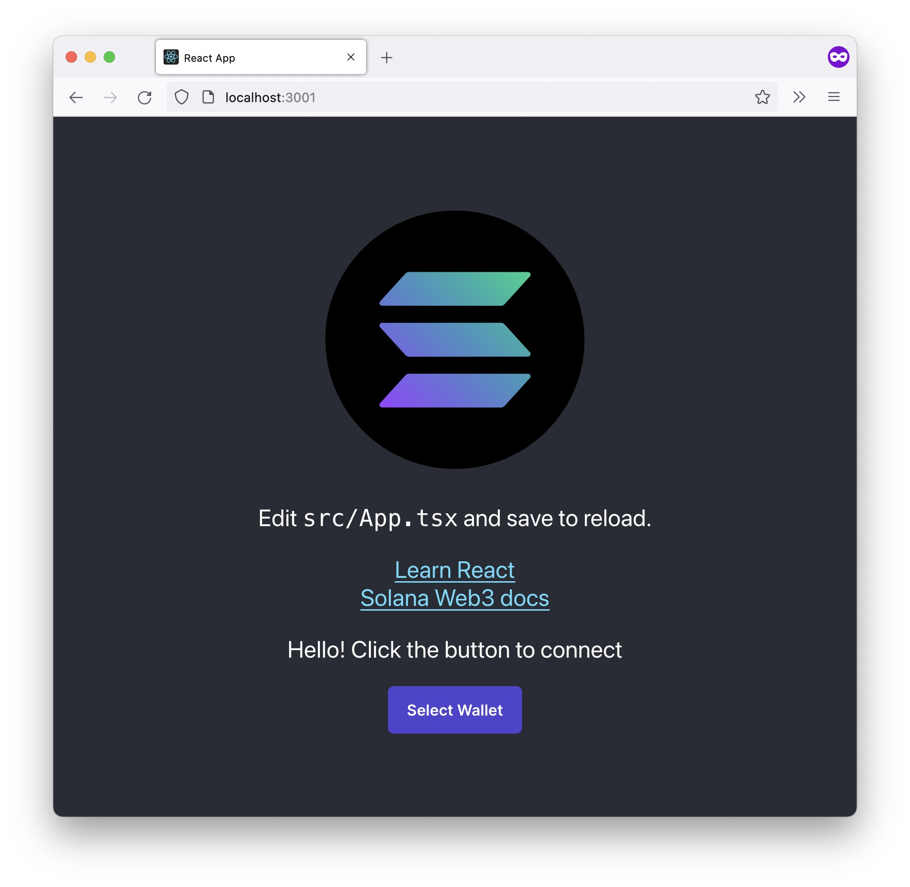

# Solana React Quickstart

This is a simple CRA app with TypeScript and Solana wallet connection through wallet-adapter

Includes:

- Typescript
- CRA
- Solana wallet adapter



## Run

```
yarn start
```

or

```
npm run start
```

## How do I sign transactions??

Create your transaction as usual and use `wallet.signTransaction()`:

```typescript
const transaction = new web3.Transaction({ feePayer: wallet.publicKey });
transaction.add(instruction1);
transaction.add(instruction2);

await wallet.signTransaction(transaction);
const transactionHash = await web3.sendAndConfirmRawTransaction(
  connection,
  transaction.serialize()
);
```

## If you use anchor

swap out `useWallet` with `useAnchorWallet` in `MyWallet.tsx`

## License

MIT
